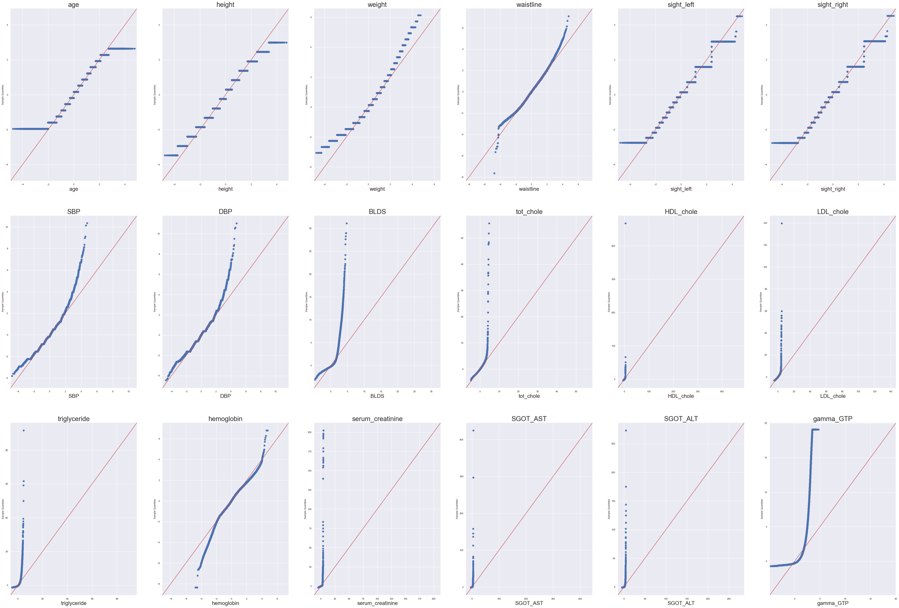

# 
 Drinker & Smoker Classification 

 Xiang Yao 

 December, 2023 

## 
 Introduction 

 This classification project aims to compare and select best fitted models in predicting whether a person is a drinker or a smoker according to some body signals. This project comprises four major components. Firstly, data summary and pre-process. Next, exploratory data analysis (EDA) is conducted to explore and display the distribution of responses and predictors. Descriptive summary, correlation heatmap, QQ-plots and histogram plots are employed to conduct distribution, correlation and normality check. 

 Then, 11 appropriate models we have learned in Math 251 are employed firstly fit and test on sample data and finally on the whole data, including K-Nearest Neighbors (KNN), Logistic Regression (LR), Linear Discriminant Analysis (LDA), Quadratic Discriminant Analysis (QDA), Naïve Bayes (NB), Decision Tree (DTree), Bootstrap Aggregation (Bagging), Random Forest Classifier (RFC), Gradient Boosting Classifier (GBC), Support Vector Machines (SVM) and Artificial Neural Networks (ANN). Finally, test error rate and computing time are used as major criterion to compare and select the best fitted model to predict drinker & smoker. 

## 1. Data and Pre-process

 The data to be used is collected from the National Health Insurance Service in Korea. I obtain it from Kaggle.com  [1] . It has 991,346 observations, 18 quantitative variables and 6 qualitative variables. There is no missing value. To clean the data, I remove 26 duplicated observations; remove 57 observations in which variable ‘waistline’ is 999 cm; change value 9.9 in variable sight_left and sight_right to be 0, which means blind. Consequently, the clean data has 991,263 observations. Furthermore, I standardize the quantitative predictors, and convert categorical values of qualitative predictors to numerical values. 

## 2. Exploratory Data Analysis (EDA)

<b> (1) Response y.</b> There are two Response y, ‘drinker’ and ‘smoker’. ‘drinker’ has two classes that 50.99% observations are in class 0 (Not Drink) and 49.01% are in class 1 (Drink). The distribution of ‘drinker’ across two classes are balanced. ‘smoker’ has three classes that 60.95% observations are in class 0 (Never Smoke), 17.35% are in class 1 (Previously Smoke), and 21.70% are in class 2 (Actively Smoke). The distribution of ‘smoker’ across its three classes are not balanced. (See Figure 1) 

 
                    

<b>Figure 1. Histogram Distribution of Response y</b>

<b>(2) Quantitative Predictors.</b> There are 18 quantitative predictors including age, weight, height, waistline, eye sights and some commonly used blood test results. Table 1 gives the descriptive summary of each quantitative predictor, including predictor’s name, definition, mean, standard deviation, minimum & maximum value, 25%, 50% and 75% quartile value. Meanwhile, I examine the histogram distribution of the quantitative predictors (See Figure 2 & 3). It is found that BLDS, tot_chole, HDL_chole, LDL_chole, triglyceride, hemoglobin, serum_creatinine, SGOT_AST, SGOT_ALT and gamma_GTP have extreme large outliers and are heavily skewed by a long right tail. This implies a certain level of violation of normal distribution. 

  

<b> Table 1. Descriptive Summary of Quantitative Predictors </b>b

  

<b> Figure 2. Histogram Distribution of Quantitative Predictors </b>

  

<b> Figure 3. HDL_chole Distribution: Full Range vs. Smaller Range </b>

 Moreover, I use correlation heatmap to check the correlation among quantitative predictors. It is found that among the 18 quantitative predictors, 8 pairs have moderate to strong correlation coefficients ([0.5,0.88]). Please see Figure 4 for Correlation Heatmap & specific correlation coefficients. The correlations between quantitative predictors might affect some classification models’ prediction performance, such as NB & Random Forest. Because NB assumes independence among predictors within each class and Random Forest has a decorrelation process. 

  

<b> Figure 4. Correlation Heatmap </b>

  

<b>Table 2. Correlation Coefficients (>= 0.50) of Quantitative Predictors</b>

 Furthermore, I use QQ-plot to do normality check (See Figure 5). Whether or not normal distribution assumption of features is satisfied would have an impact on the prediction performance of LDA & QDA. Some predictors, including age, height, weight, waistline, sight_left, sight_right, SBP, DBP and hemoglobin is somewhat alike a normal bell curve shape; however, other predictors, including BLDS, tot_chole, HDL_chole, LDL_chole, triglyceride, serum_creatinine, SGOT_AST, SGOT_ALT and gamma_GTP is totally different from normal distribution shape. Thus, normality assumption is violated in some features. I think it is the extreme large outliers stretch those predictors’ distribution shapes to the far right. 

  

<b> Figure 5. QQ-plot of Quantitative Indicators </b>

<b> (3) Qualitative Predictors.</b> Three qualitative variables are included into the models  [2] , gender, left and right hearings. There are 53.11% observations are female; 46.90% are males; 96.85% and 96.95% observations have normal left hearing and right learning, while 3.15% and 3.05% observations have abnormal left and right hearing. The distribution of left and right hearing across levels/classes are highly imbalanced. These two variables probably are not good predictors. 

## 3. Model Training and Parameter Selection. 

 The whole data set has about 1 million observations. Directly doing model training and parameter tuning on the whole data will cost a great amount of time. Thus, I start from using sample data to select some manifestly better classification models and their corresponding best parameters. Then, apply the selected model and best parameters to the whole data set to do model comparison and select the best fitted model. (See Figure 6 for Model fit and selection process) 

  

<b> Figure 6. Model Fit and Selection Process </b>

<b>Step 1. Use Sample Data to Select Models & Parameters. Firstly, Draw Random Samples.</b> From the original clean data, I randomly draw two samples. In each sample, there is one training data set and 50 test data sets. The training data in sample 1 has 10k observations, which is equivalently to about 1% of the whole data; each test data set has 1k observation. The training data in sample 2 has 100k observations, which is equivalently to about 10% of the whole data; each test data set has 5k observations. For each sample, I firstly randomly sample the training data set from the original clean data. Then, I randomly draw 50 test data sets with replacement from “original clean data – training data of that sample”, such that the training and test data in each sample don’t have an overlap. 

The reasons to draw two samples is that sample 1 uses about 1% observations to fit model. The computing time is reasonably good, but the representation of the data is not that trustworthy. Sample 2 uses about 10% observations to fit model. The representation is more trustworthy; however, it takes more than 10 hours for some models to finalize model fit. Therefore, I use both samples to fit the 10 classification models and find their best parameters. Based on the two lists of selected models and best parameters, a final list of selected models and best parameters are determined. 

<b> Secondly, Model Fit. </b> 10 classification models that we have learned in Math 251 which are applicable to tabular data are used to fit models. They are KNN, LR, LDA, QDA, NB, DTree, Bagging, RFC, GBC, SVM and ANN (Full model names are listed in Introduction). Among them, LR, LDA, QDA, NB & Bagging use fixed parameters. KNN, DTree, Random Forest, Boosting and SVM select the best parameters through employing grid search to do parameter tuning. I set CV=10 which means I employ k-folder cross validation method (k=10) to select best parameters. I use ‘decision_function_shape’ = ‘ovo’ so that SVM model could do multi-class classification & prediction. Considering ANN takes relatively long time to fit model, the best parameter selection is only done based on sample 1 using generated variable smoker_drinker  [3]  as response. The best parameters selected from what I have tried for ANN are layers = 4, neurons=[500, 400, 200, 100], p=0.5, epoch=300. Then, all ANN models use these selected best parameters to train model. Please see <b>Figure 3</b> for parameters used in grid search and the process to select models and best parameters using sample data. Besides, I set random_state=1 for KNN, DTree, Bagging, RFC, GBC & SVM.

  

 <b> Note </b>: Parameters in <b> Black color </b>: fixed parameter; in <b> Orange color </b>: use grid search to do parameter tuning; in <b> Green color </b>: use ‘sample 1 + smoker_drinker response’ to find the best parameters and apply the selected parameters to all ANN models. 

<b> Figure 7. Model Fit and Selection Process </b>

Thirdly, Select Models & Best Parameters. For each response y (drinker & smoker), all the above models are fitted on the training data of sample 1 and 2 respectively. The fitting process is the same for drinker and smoker. Let’s take response ‘drinker’ + sample 1 for example. I fit the 10 models on the training data of sample 1; use grid search to find the best parameters for each model if necessary. Then, apply the trained model and the corresponding best parameters to the 50 test data sets in sample 1 to do prediction. Based on the prediction, I calculate test error rate for each test data set using equation 

$$ \text{Test Error} = \frac{\text{Number of obs. whose predicted class is different from the given class}}{\text{Number of obs. in that test data set}} $$

Next, I draw boxplots distribution of the 50 test errors for each model (See <b>Figure 8, 9, 10, 11</b>) and calculate the average test error for each model using equation 

$$ \text{Average Test Error} = \frac {\sum_{i=1}^{50} \text{Test Error}}{50} $$

 See Table 3 for Average Test Errors for each model based on different samples and response y. 

  

<b> Table 3. Average Test Errors of Sample Data: drinker & smoker </b>

 Then, ‘Smaller Test Error Rate’ is used as the selection criteria to select models that have smaller test error rate OR to squeeze out models with obvious larger test errors. For ‘Sample 1 + Response drinker’, I select RFC, GBC, SVM, LR, LDA and ANN as better models. For ‘Sample 1 + Response smoker’ combination, I select RFC, GBC, SVM, LR and LDA as better models. For both ‘Sample 2 + Response drinker’ and ‘Sample 2 + Response smoker’ combination, the selected models are RFC, ANN, LR, LDA and KNN. Please See <b>Figure 9</b> for boxplot distribution of test errors and <b>Table 3</b> for Average Test Errors. 

 By here, for each response y, there are two lists of selected models and best parameters, one from Sample 1 and one from Sample 2. For models that use fixed parameters, no matter the model is selected by either model, use the fixed parameters; for models that is selected by one of the samples, use the corresponding best parameters; for models that use grid search to select best parameters and are selected by both samples, choose the best parameters corresponding to the lower average test error. Please see <b>Table 4 & 5</b> for the best parameter selection using sample data sets. One thing I observe in this step is generally the average test error rate of the same model get smaller from sample 1 to sample 2 in both response y. Finally, I get a single list of selected models and corresponding best parameters (See <b>Table 4 & 5</b>). An observation throughout this stage is, seemingly, as the observations in training data increases from 1% to 10% of the whole data, the test error decreases a little bit for the same model and the distribution of test errors tend to be more compact. 

  

  

<b> Table 4. Prediction Performance: drinker </b>

  

<b> Table 5. Prediction Performance: smoker </b>

 <b>Step 2, Apply the Selected Models & Parameters to the Whole Data.</b> I split the whole data set into training (70%) and test (30%) sets. For each response y, I firstly fit the above selected models and corresponding best parameters on the training data set. Then, use the trained model on test data set to do prediction and generate prediction performance indicators, including prediction accuracy, precision, recall, F1-score and computing time.  

## 4. Model Comparison & Selection

 For each response y, I firstly look for the largest prediction accuracy. Meanwhile, I also review the precision, recall and F1-score of models with the largest accuracy score. If there are no abnormal fluctuations in these indicators, I choose the model using the shortest computing time as the best fitted model. Under this criterion, for response ‘drinker’, Gradient Boosting Classifier with 73% prediction accuracy, weighted average precision, recall, F1-score and 111 second computing time is selected as the best fitted prediction model; for response ‘smoker’, the best fitted model is also Gradient Boosting Classifier with 70% prediction accuracy, weighted average precision, recall, F1-score and 536 second computing time (See <b> Table 4 & 5 </b> for predictor performance report for all models that are fitted on the whole data). 

## 5. Conclusion & Discussion

 Firstly, no matter to predict drinker or smoker, <b>Gradient Boosting Classifier is the best fitted prediction model </b> with this data set. Response ‘drinker’, which is balanced distributed across its two levels, has a larger prediction accuracy, weighted average precision, recall and F1-score (all are 73%) than that of response ‘smoker’ (all are 70%) which is imbalanced distributed across its three levels. The best model of balanced response has a little bit better prediction performance than that of imbalanced response y. But the discrepancy is small, about 3%. Meanwhile, I notice that in both drinker and smoker models, LDA model also performs well with 1%-2% lower in prediction performance indicators than that of GBC model. However, its computing time is much less than GBC model. Thus, if the selection priority is computing time, the best fitted model for both response y could be LDA model. 

  Actually, the prediction performance of all models which are selected by sample data on the whole data are very similar with each other for both response y (See <b> 
Table 4 & 5 </b>). The prediction performance indicator values of those models are within 2% difference. It implies my model fit strategy for big data set, that firstly use sample data to select better models and best parameters; then apply the selected models and parameters to the whole data to do model training and test, is a feasible approach to get consistent prediction performance. 

 Secondly, <b>Decision Tree, Bagging, Naïve Bayes and QDA perform worse compared to other models on this data set </b>. Decision Tree is expected to have a larger variance in test errors than other models. Bagging and Naïve Bayes model doesn’t work well may be because there is some correlation between some features. It violates NB model’s independence assumption and Bagging doesn’t have the decorrelation process. Further investigation is needed to explore why QDA performs worse than other models, especially than LDA. Both QDA and LDA assumes features to be normal distributed within each class. This assumption is somewhat violated by some predictors which has been discussed in EDA. However, LDA are selected by both response y and both samples as a better performer. While QDA generally performs worse in all models. 

 Thirdly, ANN model’s prediction performance doesn’t evidently surpass other models on this data set; meanwhile, its computing is relatively slow. It supports the conclusion that <b>for tabular data, tree-based models</b> (RFC & GBC for this data) <b>or Ensemble learning algorithm might be good enough </b> to do prediction, considering classification quality and computing time. For this tabular data, RFC and GBC performs consistently good using various training data and responses. 

 Finally, this project also encounters some <b>challenges</b>. The biggest challenge is <b>big data computing inefficiency</b> particularly for RFC, GBC, SVM and ANN models. I suggest training SVM model or employing grid search to do parameter tuning for GBC and RFC, don’t work on data larger than 50k observations. Moreover, <b>I don’t observe manifest prediction performance improvement through doing parameter tuning </b>. 

**Note**

 [1]: https://www.kaggle.com/datasets/sooyoungher/smoking-drinking-dataset?resource=download 

 [2]: In the original data set, there is another qualitative variable which is urine_protein with six levels. But I don’t use it to fit model. All other variables are employed by this project. 

[3]: This is a generated variable based on original response drinker & smoker. Firstly, I change ‘smoker’ from 3-level to be 2-level through combining level 1 (Previously smoke) & 2 (Actively smoke) of smoker to be level 1 (Smoker). Then, based on 2-level ‘smoker’ & ‘drinker’, I created variable ‘smoker_drinker’ with 4 levels. Level 0 = Not smoke & Not drink; Level 1 = Smoke, Not drink; Level 2 = Not smoke, Drink; Level 4 = Smoker & Drink. 

